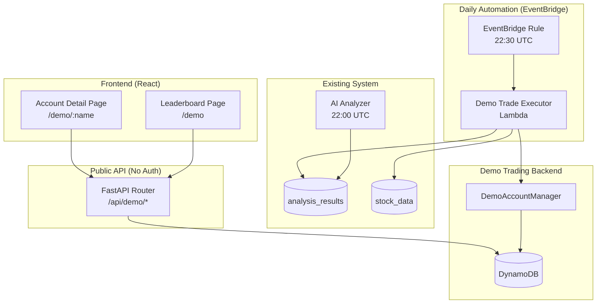

# Technical Design Document: Demo Trading Accounts

## Overview

This feature adds 100 simulated trading accounts to the Stock Monitoring and Analysis System. Each account is named after a superhero, starts with $10,000, and autonomously executes trades based on existing AI recommendations with a 1% commission per transaction. A public-facing dashboard (no auth) shows a leaderboard, portfolio performance charts, and full transaction history.

The feature integrates with the existing `ai_analyzer` output and `stock_data` DynamoDB entities, triggered daily via EventBridge after AI analysis completes. The frontend uses Recharts for charting on two new public pages.

## Architecture



**Key decisions:**
- **Recharts** for frontend charts (React-native, lightweight, good line/pie chart support, already in the React ecosystem)
- **Single Lambda** for demo trade execution, triggered 30 minutes after AI analyzer completes (22:30 UTC)
- **Daily snapshots table** for efficient time-series queries without recalculating historical portfolio values
- **Public API router** with no auth middleware, separate from existing authenticated endpoints

## Components and Interfaces

### 1. DemoAccountManager (Backend Service)

**Location:** `backend/src/services/demo_account_manager.py`

Manages account creation, storage, and snapshot generation.

```python
class DemoAccountManager:
    def create_accounts(self, count: int = 100) -> list[DemoAccount]:
        """Create demo accounts with random initial allocations."""
        ...

    def get_account(self, name: str) -> DemoAccount | None:
        """Retrieve a single demo account by superhero name."""
        ...

    def get_leaderboard(self) -> list[LeaderboardEntry]:
        """Get all accounts ranked by portfolio value descending."""
        ...

    def get_transactions(self, name: str, page: int, page_size: int) -> PaginatedTransactions:
        """Get paginated transaction history for an account."""
        ...

    def get_performance_series(self, name: str) -> list[DailySnapshot]:
        """Get daily portfolio value time series for an account."""
        ...

    def record_transaction(self, txn: Transaction) -> None:
        """Store a transaction record."""
        ...

    def take_daily_snapshot(self, account_name: str, snapshot_date: date) -> None:
        """Record end-of-day portfolio snapshot for an account."""
        ...
```

### 2. DemoTradeExecutor (Lambda Handler)

**Location:** `backend/src/services/demo_trade_executor.py`

Executes daily trades based on AI recommendations.

```python
class DemoTradeExecutor:
    def execute_daily_trades(self) -> ExecutionSummary:
        """Run trading logic for all 100 accounts."""
        ...

    def _evaluate_account(self, account: DemoAccount, recommendations: dict[str, str]) -> list[Transaction]:
        """Determine buy/sell actions for a single account."""
        ...

    def _execute_buy(self, account: DemoAccount, ticker: str, close_price: Decimal) -> Transaction | None:
        """Execute a buy order: up to 10% of portfolio value, max whole shares."""
        ...

    def _execute_sell(self, account: DemoAccount, ticker: str, close_price: Decimal) -> Transaction:
        """Execute a sell order: liquidate entire position."""
        ...
```

### 3. Public API Router

**Location:** `backend/src/api/demo.py`

```python
# All endpoints are public (no auth middleware)
router = APIRouter(prefix="/api/demo", tags=["demo"])

@router.get("/leaderboard")
async def get_leaderboard() -> LeaderboardResponse: ...

@router.get("/accounts/{name}")
async def get_account_detail(name: str) -> AccountDetailResponse: ...

@router.get("/accounts/{name}/transactions")
async def get_transactions(name: str, page: int = 1, page_size: int = 20) -> PaginatedTransactionsResponse: ...

@router.get("/accounts/{name}/performance")
async def get_performance(name: str) -> PerformanceResponse: ...
```

### 4. Frontend Pages

**Leaderboard Page** (`frontend/src/pages/DemoLeaderboard.tsx`):
- Table of 100 accounts sorted by portfolio value
- Columns: rank, name, portfolio value, cash, gain/loss %, transactions count
- Sparkline per row showing recent performance trend
- Click row → navigate to account detail
- Last updated timestamp

**Account Detail Page** (`frontend/src/pages/DemoAccountDetail.tsx`):
- Header: superhero name, portfolio value, cash, total gain/loss
- Portfolio value line chart (Recharts `LineChart`) with $10,000 reference line
- Current holdings table with unrealized P&L
- Portfolio composition pie chart (Recharts `PieChart`)
- Paginated transaction history table
- Back to leaderboard navigation

## Data Models

### Database Migration (`002_demo_trading_accounts.sql`)

```sql
-- Demo trading accounts
CREATE TABLE demo_accounts (
    id SERIAL PRIMARY KEY,
    account_name VARCHAR(100) UNIQUE NOT NULL,
    cash_balance DECIMAL(12,2) NOT NULL DEFAULT 10000.00,
    created_at TIMESTAMP NOT NULL DEFAULT NOW()
);

-- Demo account stock holdings
CREATE TABLE demo_holdings (
    id BIGSERIAL PRIMARY KEY,
    account_id INTEGER NOT NULL REFERENCES demo_accounts(id),
    ticker VARCHAR(10) NOT NULL REFERENCES stocks(ticker),
    quantity INTEGER NOT NULL CHECK (quantity > 0),
    purchase_price DECIMAL(12,4) NOT NULL,
    purchased_at TIMESTAMP NOT NULL DEFAULT NOW(),
    UNIQUE(account_id, ticker)
);

-- Demo account transactions
CREATE TABLE demo_transactions (
    id BIGSERIAL PRIMARY KEY,
    account_id INTEGER NOT NULL REFERENCES demo_accounts(id),
    ticker VARCHAR(10) NOT NULL,
    action VARCHAR(4) NOT NULL CHECK (action IN ('BUY', 'SELL')),
    quantity INTEGER NOT NULL CHECK (quantity > 0),
    price_per_share DECIMAL(12,4) NOT NULL,
    total_value DECIMAL(12,2) NOT NULL,
    commission_fee DECIMAL(12,2) NOT NULL,
    cash_after DECIMAL(12,2) NOT NULL,
    executed_at TIMESTAMP NOT NULL DEFAULT NOW()
);

-- Daily portfolio snapshots for time series
CREATE TABLE demo_daily_snapshots (
    id BIGSERIAL PRIMARY KEY,
    account_id INTEGER NOT NULL REFERENCES demo_accounts(id),
    snapshot_date DATE NOT NULL,
    portfolio_value DECIMAL(12,2) NOT NULL,
    cash_balance DECIMAL(12,2) NOT NULL,
    holdings_value DECIMAL(12,2) NOT NULL,
    created_at TIMESTAMP NOT NULL DEFAULT NOW(),
    UNIQUE(account_id, snapshot_date)
);

-- Indexes
CREATE INDEX idx_demo_holdings_account ON demo_holdings(account_id);
CREATE INDEX idx_demo_transactions_account ON demo_transactions(account_id);
CREATE INDEX idx_demo_transactions_executed ON demo_transactions(executed_at DESC);
CREATE INDEX idx_demo_snapshots_account_date ON demo_daily_snapshots(account_id, snapshot_date);
```

### Pydantic Schemas

```python
class DemoAccount(BaseModel):
    id: int
    account_name: str
    cash_balance: Decimal
    created_at: datetime

class DemoHolding(BaseModel):
    ticker: str
    quantity: int
    purchase_price: Decimal
    current_price: Decimal | None = None
    unrealized_gain_loss: Decimal | None = None

class DemoTransaction(BaseModel):
    id: int
    ticker: str
    action: Literal["BUY", "SELL"]
    quantity: int
    price_per_share: Decimal
    total_value: Decimal
    commission_fee: Decimal
    cash_after: Decimal
    executed_at: datetime

class DailySnapshot(BaseModel):
    snapshot_date: date
    portfolio_value: Decimal
    cash_balance: Decimal
    holdings_value: Decimal

class LeaderboardEntry(BaseModel):
    rank: int
    account_name: str
    portfolio_value: Decimal
    cash_balance: Decimal
    gain_loss_pct: Decimal
    transaction_count: int
    sparkline_data: list[Decimal]  # last 30 days of portfolio values

class LeaderboardResponse(BaseModel):
    entries: list[LeaderboardEntry]
    last_updated: datetime

class AccountDetailResponse(BaseModel):
    account_name: str
    portfolio_value: Decimal
    cash_balance: Decimal
    total_gain_loss: Decimal
    gain_loss_pct: Decimal
    holdings: list[DemoHolding]
    allocation: list[AllocationEntry]  # for pie chart

class AllocationEntry(BaseModel):
    label: str  # ticker or "Cash"
    value: Decimal
    percentage: Decimal

class PaginatedTransactionsResponse(BaseModel):
    transactions: list[DemoTransaction]
    total: int
    page: int
    page_size: int
    total_pages: int

class PerformanceResponse(BaseModel):
    account_name: str
    data_points: list[DailySnapshot]
    initial_value: Decimal  # always 10000.00
```

## Correctness Properties

*A property is a characteristic or behavior that should hold true across all valid executions of a system — essentially, a formal statement about what the system should do. Properties serve as the bridge between human-readable specifications and machine-verifiable correctness guarantees.*

### Property 1: Initial bankroll invariant

*For any* created demo account, the sum of cash_balance plus the total cost of all initial stock purchases (quantity × purchase_price × 1.01 for each holding) SHALL equal $10,000.00, AND cash_balance SHALL be between $500.00 and $9,500.00 inclusive.

**Validates: Requirements 1.2, 1.3**

### Property 2: Holdings only from active watchlist

*For any* demo account at creation time, every ticker in its holdings SHALL exist in the active stocks watchlist (is_active = TRUE).

**Validates: Requirements 1.4**

### Property 3: Commission is always exactly 1%

*For any* transaction (buy or sell, initial or daily), the commission_fee SHALL equal exactly 0.01 × total_value (quantity × price_per_share).

**Validates: Requirements 1.5, 2.4**

### Property 4: Buy allocation capped at 10% of portfolio value

*For any* daily buy transaction, the total_value (including commission) SHALL be less than or equal to 10% of the account's portfolio value at the time of execution.

**Validates: Requirements 2.2**

### Property 5: Sell liquidates entire position

*For any* sell transaction executed on a demo account for a given ticker, after execution the account SHALL hold 0 shares of that ticker.

**Validates: Requirements 2.3**

### Property 6: Buy quantity calculation correctness

*For any* buy transaction with an allocated budget B and stock price P, the quantity purchased SHALL equal floor(B / (P × 1.01)), using the maximum whole shares purchasable within the budget after commission.

**Validates: Requirements 2.5**

### Property 7: Sell credit calculation correctness

*For any* sell transaction with quantity Q and closing price P, the cash credited to the account SHALL equal Q × P × 0.99 (sale proceeds minus 1% commission).

**Validates: Requirements 2.6**

### Property 8: Insufficient cash prevents buy

*For any* demo account where available cash is less than a stock's closing price × 1.01, a BUY recommendation for that stock SHALL result in no transaction being recorded for that account and stock.

**Validates: Requirements 2.7**

### Property 9: HOLD produces no transaction

*For any* stock with a HOLD recommendation on a given day, no transaction SHALL be recorded for that stock on that day across any demo account.

**Validates: Requirements 2.9**

### Property 10: Transaction persistence round-trip

*For any* transaction executed by the DemoTradeExecutor, querying the transaction history SHALL return a record containing: account_name, ticker, action, quantity, price_per_share, total_value, commission_fee, cash_after, and executed_at — all matching the original execution values.

**Validates: Requirements 2.8, 3.1, 3.2**

### Property 11: Daily snapshot exists for each trading day

*For any* day where at least one transaction was executed, a daily snapshot SHALL exist for every demo account, containing portfolio_value, cash_balance, and holdings_value.

**Validates: Requirements 3.3**

### Property 12: Leaderboard sorted by portfolio value descending

*For any* leaderboard response, for all consecutive pairs of entries (i, i+1), entry[i].portfolio_value SHALL be greater than or equal to entry[i+1].portfolio_value.

**Validates: Requirements 4.1**

### Property 13: Transaction history sorted by date descending

*For any* paginated transaction history response, for all consecutive pairs of transactions (i, i+1), transaction[i].executed_at SHALL be greater than or equal to transaction[i+1].executed_at.

**Validates: Requirements 6.3**

## Error Handling

| Scenario | Handling |
|----------|----------|
| Fewer than 10 active stocks at creation | Reject creation, log error, return descriptive error message |
| Insufficient cash for buy | Skip transaction, log skip reason with account name and ticker |
| Stock price unavailable (no recent stock_data) | Skip that stock for all accounts, log warning |
| Database connection failure during trading | Retry up to 3 times with exponential backoff, then fail the Lambda with error |
| Account not found (404) | Return `{"error": "Demo account not found", "name": "<requested>"}` with HTTP 404 |
| Lambda timeout during trading | Process accounts in batches of 25, commit after each batch for partial progress |
| Invalid account name in URL | Normalize URL-decoded name, return 404 if no match |

## Testing Strategy

### Property-Based Tests (Hypothesis)

The project uses Python with pytest. Property-based tests will use the **Hypothesis** library (already compatible with the pytest setup).

**Configuration:**
- Minimum 100 iterations per property test (`@settings(max_examples=100)`)
- Each test tagged with a comment referencing its design property
- Tag format: `# Feature: demo-trading-accounts, Property N: <title>`

Property tests focus on the pure business logic in `DemoAccountManager` and `DemoTradeExecutor`:
- Account creation allocation logic (Properties 1, 2, 3)
- Trade execution math (Properties 3, 4, 5, 6, 7, 8, 9)
- Data completeness (Property 10)
- Sort ordering (Properties 12, 13)

### Unit Tests (pytest)

Example-based tests for:
- API endpoint accessibility without auth (Requirements 7.1–7.4)
- 404 response for non-existent account (Requirement 7.5)
- Leaderboard includes last_updated timestamp (Requirement 4.5)
- Account detail response includes allocation data for pie chart (Requirement 6.6)
- Edge case: creation with fewer than 10 active stocks (Requirement 1.7)

### Integration Tests

- End-to-end: AI analysis → EventBridge trigger → trade execution → snapshot generation
- Database migration applies cleanly
- API returns correct data after trade execution completes
