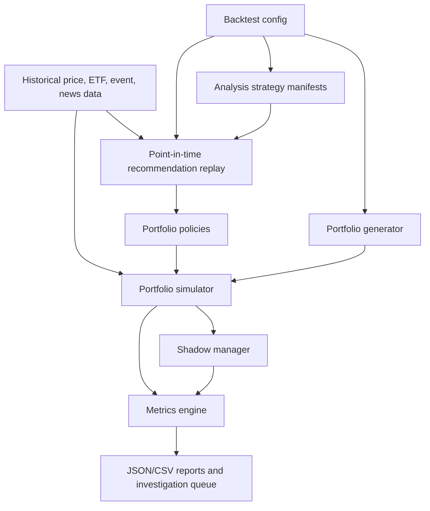

# Technical Design Document: Backtest Support With Shadowed Portfolios

## Overview

Backtest Support With Shadowed Portfolios is an offline-first evaluation system for Stockara's recommendation engine. It replays historical dates, generates deterministic simulated portfolios, applies versioned Stockara analysis strategies and portfolio policies, forks shadows around portfolio-changing decisions, and produces reports that show whether active Stockara decisions added value versus doing nothing or buying an ETF.

The design intentionally starts as a backend S3 artifact pipeline rather than a user-facing feature. This keeps the first implementation focused on correctness, point-in-time discipline, durable run history, and evaluation quality.

## Design Goals

- Measure Stockara decision quality at portfolio level, not only ticker recommendation quality.
- Version Stockara's analyzer business logic as `AnalysisStrategy` manifests so preselection, prompts, AI models, review gates, and publication rules can be compared and promoted or rejected based on evidence.
- Avoid hindsight leakage by enforcing point-in-time evidence windows.
- Make conservative, balanced, and aggressive behavior comparable.
- Explain underperformance through decision shadows and investigation reports.
- Use S3 as the durable source for backtest input snapshots, run outputs, metrics, and investigation artifacts.
- Build accounting invariants with Decimal-style precision and property tests.

## Non-Goals

- Real-user portfolio tracking.
- Authenticated portfolio APIs.
- Encrypted simulated portfolio storage.
- Automated live trading.
- Tax modeling.
- Full intraday execution simulation.
- UI dashboard in the first milestone.

## Proposed Module Layout

```text
backend/src/backtesting/
  __init__.py
  cli.py
  config.py
  data_loader.py
  events.py
  analysis_strategy.py
  metrics.py
  models.py
  portfolio_generator.py
  recommendation_replay.py
  reporting.py
  shadows.py
  simulator.py
  portfolio_policies.py

backend/tests/backtesting/
  test_analysis_strategy_manifest.py
  test_backtest_data_windows.py
  test_backtest_metrics.py
  test_backtest_portfolio_generator.py
  test_backtest_shadow_portfolios.py
  test_backtest_simulator_accounting.py
  test_backtest_portfolio_policies.py
```

## Component Architecture



## Data Sources

### Required Data

- Daily OHLCV for watchlist stocks.
- Daily adjusted OHLCV for ETF baseline, initially SPY or VOO.
- Watchlist metadata: ticker, company name, sector, company size, active flag, provider symbols.
- Existing or replayed Stockara recommendations where available.
- Historical news with publication timestamps.
- Historical earnings events and known-at timestamp.
- Historical dividend events and known-at timestamp.
- Delisted or inactive ticker history to reduce survivorship bias.
- Sector ETF metadata and price history.
- Point-in-time evidence provenance for every historical input used by the analyzer.

The first usable run may still be staged behind incomplete provider coverage, but the architecture treats all of the above as required for decision-grade backtesting. Any run missing one of these inputs must be labeled as reduced-evidence and must not be used as the final reliability verdict for Stockara.

## Storage Strategy

Use S3 as the primary durable store for backtest inputs, immutable run outputs, metrics, and investigation artifacts. Local files may be used only as a developer cache or temporary export; S3 is the canonical run record.

```text
backtests/data/prices/instrument_type={stock|etf}/ticker={ticker}/...
backtests/data/news/publication_date={YYYY-MM-DD}/...
backtests/data/events/earnings/event_date={YYYY-MM-DD}/...
backtests/data/events/dividends/ex_date={YYYY-MM-DD}/...
backtests/data/instruments/latest.json
backtests/analysis-strategies/{analysis_strategy_id}/manifest.yaml
backtests/recommendations/analysis_strategy={analysis_strategy_id}/analysis_date={YYYY-MM-DD}/...
backtests/runs/{run_id}/config.json
backtests/runs/{run_id}/analysis_strategies/{analysis_strategy_id}.yaml
backtests/runs/{run_id}/portfolios.json
backtests/runs/{run_id}/transactions.csv
backtests/runs/{run_id}/snapshots.csv
backtests/runs/{run_id}/shadows.csv
backtests/runs/{run_id}/metrics.json
backtests/runs/{run_id}/investigation_queue.csv
backtests/runs/{run_id}/limitations.json
backtests/runs/{run_id}/comparison/analysis_strategy_leaderboard.csv
backtests/runs/{run_id}/comparison/analysis_strategy_pairwise.csv
```

Run IDs should be immutable. If the same logical experiment is repeated with corrected inputs or strategy code, create a new run ID and link it to the previous run through metadata.

## Core Models

### BacktestConfig

- `run_id`
- `start_date`
- `end_date`
- `initial_capital`
- `portfolio_count`
- `random_seed`
- `commission_rate`
- `execution_timing`
- `analysis_strategy_ids`
- `portfolio_policy_ids`
- `baseline_etfs`
- `shadow_windows_days`
- `material_decision_threshold`
- `data_sources`
- `analysis_strategy_registry`
- `recommendation_cache_policy`

### AnalysisStrategy

An `AnalysisStrategy` is a versioned snapshot of Stockara's analyzer business logic. It is separate from portfolio policy. It answers: "How did Stockara decide which tickers to analyze, what evidence to include, which models/prompts to use, and which recommendations to publish?"

- `analysis_strategy_id`
- `status`: `baseline`, `candidate`, `promoted`, `rejected`, or `archived`
- `parent_analysis_strategy_id`
- `git_commit`
- `created_at`
- `description`
- `preselection_flow_version`
- `predicates`
- `filters`
- `scoring_version`
- `scoring_weights`
- `candidate_limits`
- `required_evidence`
- `optional_evidence`
- `used_data_sources`
- `excluded_data_sources`
- `missing_evidence_behavior`
- `recommendation_model`
- `recommendation_prompt_template`
- `recommendation_prompt_inputs`
- `recommendation_output_schema_version`
- `review_model`
- `review_prompt_template`
- `review_gate_rules`
- `publication_rules`
- `fallback_rules`
- `cost_limits`

Example manifest:

```yaml
analysis_strategy:
  id: analysis_strategy_2026_07_07_earnings_v2
  status: candidate
  parent: analysis_strategy_2026_06_30_baseline_v1
  git_commit: abc123
  created_at: 2026-07-07
  description: Adds earnings proximity and dividend context to preselection.

preselection:
  flow_version: preselection_pipeline_v2
  predicates:
    - active_watchlist_only
    - price_data_fresh
    - min_30d_ohlcv
    - exclude_low_liquidity
    - upcoming_earnings_window_14d
  scoring:
    version: candidate_score_v3
    weights:
      momentum: 0.25
      volume_spike: 0.20
      news_sentiment: 0.20
      earnings_proximity: 0.20
      dividend_signal: 0.15
  limits:
    max_candidates_per_day: 100
    max_ai_analyzed_per_day: 30

recommendation_ai:
  model: gpt-5.4-mini
  prompt_template: recommendation_news_events_v2
  prompt_inputs:
    - ohlcv_30d
    - technical_indicators
    - news_7d
    - earnings_context
    - dividend_context
    - missing_evidence_summary

review_ai:
  enabled: true
  model: gpt-5.4
  prompt_template: strict_review_v2
  review_gate:
    require_for_public_buy_sell: true
    reject_if_missing_catalyst: true
    reject_if_stale_price_data: true

publication:
  suppress_stale_tickers: true
  suppress_review_rejected_buy_sell: true
  expose_partial_coverage: true
```

### BacktestPortfolio

- `portfolio_id`
- `portfolio_policy_id`
- `initial_allocation_method`
- `cash`
- `holdings`
- `transactions`
- `snapshots`
- `metadata`

### BacktestHolding

- `ticker`
- `quantity`
- `average_cost`
- `opened_date`
- `instrument_type`

### BacktestTransaction

- `portfolio_id`
- `date`
- `ticker`
- `action`
- `quantity`
- `execution_price`
- `gross_value`
- `commission`
- `cash_after`
- `reason`
- `source_recommendation_id`

### DecisionShadow

- `shadow_id`
- `parent_portfolio_id`
- `decision_date`
- `trigger_action`
- `ignored_action`
- `pre_trade_cash`
- `pre_trade_holdings`
- `evaluation_windows`
- `status`
- `underperformance_reason`

### BacktestSnapshot

- `portfolio_id`
- `date`
- `cash`
- `holdings_value`
- `total_value`
- `realized_gain_loss`
- `unrealized_gain_loss`
- `commission_paid_to_date`
- `data_quality_status`

## Analysis Strategy Versus Portfolio Policy

The backtest has two different strategy concepts:

1. **AnalysisStrategy**
   The versioned Stockara analyzer business logic: preselection, predicates, filters, scoring, prompt data, AI models, review gates, and publication rules.

2. **PortfolioPolicy**
   The simulated investor behavior that acts on recommendations: conservative, balanced, aggressive, ETF fallback, turnover limits, and replacement thresholds.

All analysis strategies in a comparison run should use the same shared market data snapshot, starting portfolios, execution timing, commission rate, and portfolio policies. This makes the question clean: did the analyzer logic improve, or did only the investor action policy change?

## Portfolio Policies

### Conservative

- BUY only when recommendation is BUY.
- Require successful stronger AI review.
- Require LOW risk.
- Allow only blue-chip stocks.
- Use lower maximum single-position exposure.
- Prefer cash or ETF baseline when no qualified opportunity exists.
- SELL only when a strong accepted SELL signal or severe deterioration is present.

### Balanced

- BUY when recommendation is BUY and risk is LOW or MEDIUM.
- Allow blue-chip and mid-cap stocks.
- Prefer review-passed recommendations, but may allow high-confidence recommendations with weaker review status if configured.
- Moderate position sizing and turnover.
- Replace holdings only with a meaningful candidate score improvement.

### Aggressive

- Allow startup/high-growth tickers.
- Allow promising recommendations even when stronger AI review failed, but record review-failed exposure.
- Higher maximum position exposure and turnover.
- More willing to replace weak holdings.

## Shadow Portfolio Semantics

The simulator creates three comparison classes:

1. **Global hold shadow**
   Starts with the same holdings as the main portfolio and never trades after initialization.

2. **Decision shadow**
   Created when a material main-portfolio action occurs. It forks from the pre-trade state and ignores the triggering action. It is evaluated over fixed windows: 7, 30, 90, 180, and 365 calendar days.

3. **Policy shadow**
   Replays the same recommendation stream with a different portfolio policy. This is useful for comparing conservative versus aggressive AI review behavior.

Decision shadows should not recursively spawn more decision shadows in the first implementation. They are diagnostic probes, not full alternate universes.

## Execution Timing

The first implementation should use one documented rule:

- Recommendations produced after market close execute at the next available close or next open, whichever the implementation can support consistently with stored data.

The selected rule must be stored in `BacktestConfig` and included in reports.

## Metrics

Per portfolio:

- Final value.
- Total return.
- Annualized return.
- Max drawdown.
- Volatility.
- Trade count.
- Buy count and sell count.
- Turnover.
- Commission paid.
- Commission drag.
- Cash utilization.

Per decision shadow:

- Main value and shadow value at decision time.
- Main-vs-shadow delta after 7, 30, 90, 180, and 365 days.
- Trigger action type.
- Accepted recommendation metadata.
- Rejected or ignored alternative metadata.
- Underperformance classification.

Aggregate:

- Results by analysis strategy.
- Results by portfolio policy.
- Results by initial concentration.
- Results by sector concentration.
- Results by company-size mix.
- Results by evidence coverage.
- Stockara vs global hold.
- Stockara vs ETF baseline.
- Review-passed vs review-failed decision outcomes.
- Candidate-selection deltas by analysis strategy.
- Prompt/model/review-gate deltas by analysis strategy.

## Analysis Strategy Comparison

Every meaningful analyzer change should be frozen as an `AnalysisStrategy` before backtesting. A backtest run may compare one candidate analysis strategy against the current baseline, or compare several candidates against the same baseline.

The comparison must keep these fixed across strategies:

- Historical data snapshot.
- Starting portfolio set.
- Trading calendar.
- Execution price rule.
- Commission rate.
- Portfolio policies.
- Cost budget, unless the experiment explicitly studies cost.

Per analysis strategy, store:

- `manifest.yaml`
- `candidate_scores.csv`
- `rejected_candidates.csv`
- `ai_recommendation_requests.jsonl`
- `ai_recommendation_responses.jsonl`
- `ai_review_requests.jsonl`
- `ai_review_responses.jsonl`
- `publication_decisions.csv`
- `suppression_reasons.csv`
- `daily_decisions.csv`
- `transactions.csv`
- `snapshots.csv`
- `decision_shadows.csv`
- `metrics.json`
- `cost_report.json`

Suggested S3 layout:

```text
backtests/runs/{run_id}/
  run_config.yaml
  shared_data_snapshot.json
  portfolios/
    initial_portfolios.json
  baselines/
    spy_hold.csv
    global_hold_shadows.csv
  analysis_strategies/
    {analysis_strategy_id}/
      manifest.yaml
      candidates/
      ai/
      publication/
      decisions/
      trades/
      shadows/
      metrics.json
      cost_report.json
  comparison/
    analysis_strategy_leaderboard.csv
    analysis_strategy_pairwise_comparison.csv
    investigation_queue.csv
```

Promotion guidance:

- Promote a candidate analysis strategy only when it beats or preserves the baseline across agreed benchmark windows and risk metrics.
- Reject or keep experimental when it improves headline return by increasing unacceptable drawdown, cost, overtrading, stale-data exposure, or unexplained shadow underperformance.
- Keep rejected strategy artifacts. They are useful regression evidence.

## Point-in-Time Controls

Every data loader must accept an `as_of` date or timestamp. The recommendation replay layer must build inputs only from records available at or before that timestamp. Reports must include evidence coverage so reduced-evidence runs are not confused with full historical replay.

Known limitations should be explicit:

- Current active watchlist creates survivorship bias until delisted/inactive history is added.
- Historical news may be unavailable or incomplete.
- Provider-adjusted prices may not fully model dividend reinvestment.
- Event history may contain revised fields that were not known on the historical date unless provider provenance proves otherwise.

## CLI Shape

Initial local command:

```bash
cd backend
python -m src.backtesting.cli run \
  --start-date 2022-01-01 \
  --end-date 2026-01-01 \
  --portfolio-count 100 \
  --seed 20220101 \
  --commission-rate 0.01 \
  --baseline-etf SPY \
  --s3-prefix s3://{stockara-artifact-bucket}/backtests
```

Later commands:

```bash
python -m src.backtesting.cli summarize --run-id {run_id}
python -m src.backtesting.cli export-investigation-queue --run-id {run_id}
```

## Development Sequence

1. Build the S3-backed historical data snapshot shape for prices, ETFs, news, earnings, dividends, instrument metadata, and point-in-time provenance.
2. Define `AnalysisStrategy` manifests and freeze the current hardcoded analyzer behavior as the first baseline.
3. Build a deterministic simulator with ETF baseline, global hold shadows, portfolio policies, and complete historical evidence coverage labels.
4. Add recommendation replay keyed by analysis strategy ID from S3-cached recommendation fixtures.
5. Add decision shadows and investigation outputs.
6. Add analysis-strategy pairwise comparison reports and promotion/rejection metadata.
7. Add point-in-time AI analyzer replay on top of the historical evidence snapshot.
8. Add optional frontend reporting after the S3 artifact pipeline is stable.

## Risks and Mitigations

- **Hindsight leakage**: enforce `as_of` filters in data-loader tests and include future-row regression tests.
- **Survivorship bias**: include inactive/delisted ticker history in decision-grade runs and label reduced-evidence development runs clearly when that coverage is incomplete.
- **AI cost explosion**: cache recommendation outputs by date, ticker, evidence hash, model, and analysis strategy ID.
- **Analyzer-version ambiguity**: every backtest run must include immutable `AnalysisStrategy` manifests and cache AI outputs by analysis strategy ID.
- **Shadow explosion**: bound decision shadows by materiality, fixed windows, and no recursive forks.
- **Accounting drift**: use Decimal-style calculations and property tests for every trade invariant.
- **Misleading ETF comparison**: document dividend/adjustment assumptions and use adjusted prices where possible.
