# Stockara Stock Data Collection and Analysis Process

Audience: stock market experts, investment reviewers, and product stakeholders.

Status: Stockara 1.0 implementation, written for stock-domain review. The
runtime and backlog baseline is `docs/steering/stockara-1.0.md`.

## Purpose

Stockara is a daily stock opportunity and risk scanner. Its goal is not to claim that it has found the absolute best stocks in the whole market every day. Instead, Stockara publishes the strongest BUY opportunities and urgent SELL alerts among stocks whose data is fresh, sufficiently supported, and reviewable.

Stockara is deliberately conservative:

- It suppresses stocks with stale or insufficient price history.
- It shows data-quality warnings when market coverage is partial.
- It separates positive opportunity signals from negative risk signals.
- It requires AI-generated BUY and SELL recommendations to pass a second review step before they appear publicly.
- It shows rejected AI recommendations separately so reviewers can see what was considered but withheld.

## Stockara daily workflow

```mermaid
flowchart LR
  Universe["Tracked stock universe"] --> Orchestrator["Step Functions daily workflow"]
  Orchestrator --> Collect["Collect market, news, event, sector, and macro data"]
  Collect --> Clean["Validate, deduplicate, summarize, and normalize"]
  Clean --> Gates["Apply data-quality gates"]
  Gates --> Score["Score opportunity and risk signals"]
  Score --> Shortlist["Shortlist strongest candidates"]
  Shortlist --> AI["AI analyst review"]
  AI --> Review["Stricter AI publication review"]
  Review --> Publish["Publish top picks, sell alerts, warnings, and charts"]
  Publish --> Experts["Expert review in the web UI"]
```

## What Stockara Collects

Stockara collects several categories of evidence. The intent is to combine price action, news, company events, analyst context, sector context, and broader market context rather than relying on one signal type.

### Tracked Stock Universe

For every tracked stock, Stockara keeps basic company context:

- Ticker.
- Company name.
- Sector.
- Company size category.
- Exchange and currency when available.
- Industry and business description when available.
- Market cap and other static company metadata when available.
- Products, revenue segments, customer types, geographic exposure, competitive position, and static risks when available.

This context helps the analysis avoid treating all stocks as interchangeable. For example, a small speculative stock, a mature blue-chip stock, and a rate-sensitive financial stock may need different interpretation even when the raw price movement looks similar.

### Price and Volume Data

Stockara collects open, high, low, close, and volume data for tracked stocks.

Sources:

- Primary source: yfinance.
- Fallback source when configured: Alpha Vantage.
- Additional fallback sources for normal market-data recovery: Nasdaq historical data and Stooq.

Schedule:

- Price collection runs throughout the day in small bounded batches.
- A daily price-gap check runs after the normal collection window to identify missing recent trading days.
- The analysis process expects current data before the daily publication.

Important handling rules:

- Each stock should have one record per trading date.
- Duplicate records are skipped instead of overwritten.
- Malformed records are discarded.
- Provider failures are retried.
- Every usable price row must have source provenance so reviewers can trace where the market data came from.

### News Data

Stockara collects stock-market and company-related news.

Sources:

- NewsAPI when configured.
- Finnhub general market and company news when configured.
- Alpha Vantage news sentiment when configured.

Schedule:

- News collection currently runs daily before the Stockara publication.
- The broader product requirement supports more frequent polling, but the current publication process uses a bounded pre-publication collection run.

Processing:

- Duplicate articles are removed using title plus source.
- New articles are summarized into a concise structured format.
- Each article is connected to related tickers when possible.
- Articles without identifiable tickers can still be retained as unclassified market context.

Each news summary contains:

- Title.
- Source.
- Publication time.
- Related tickers.
- Summary text.
- Sentiment or direction when available.

### Earnings and Dividend Data

Stockara collects earnings and dividend context so near-term recommendations can account for calendar risk and potential catalysts.

Schedule:

- Earnings data is collected daily before publication.
- Dividend data is collected daily before publication.

Collected context can include:

- Upcoming earnings dates.
- Historical earnings reactions.
- Upcoming dividend events.
- Historical dividend reactions.
- Earnings release signals.
- Earnings transcript signals when available.

### Company, Analyst, Sector, and Macro Evidence

Stockara also collects broader evidence signals.

Company and analyst evidence:

- Material SEC filings, such as 8-K, 10-K, 10-Q, S-1, S-3, S-4, SC 13D, and SC 13G.
- Analyst recommendation actions.
- Analyst rating snapshots.
- Price target signals.

Sector context:

- Stockara compares company behavior with representative sector ETFs, such as technology, healthcare, financials, energy, consumer, industrials, materials, utilities, real estate, and communication services.

Macro context:

- Stockara tracks broad market and macro proxies such as broad equities, growth equities, small caps, long-duration bonds, the 10-year yield, the US dollar, gold, inflation-protected bonds, and intermediate Treasuries.

Why this matters:

- A stock rising while its sector is weak can be a stronger relative-strength signal.
- A selloff during broad market stress may have a different meaning from a company-specific selloff.
- A recommendation made just before earnings or a dividend event needs extra caution.

## How Stockara Processes the Data

After collection, Stockara prepares evidence for scoring and review.

Price and volume processing:

- Sort recent trading records by date.
- Validate price and volume fields.
- Check latest available trading date.
- Calculate recent price changes.
- Compare latest volume with prior average volume.
- Derive multi-day market context, including trend, support, resistance, and a 20-day simple moving average.

News processing:

- Remove duplicate articles.
- Summarize article content.
- Link summaries to tickers.
- Assign direction or sentiment where possible.
- Keep source and publication time for traceability.

Event processing:

- Convert SEC filings, analyst actions, price targets, earnings, dividends, sector moves, and macro changes into comparable evidence signals.
- Assign each signal a direction: positive, negative, or neutral.
- Assign each signal a strength score.
- Keep the original source/provider and observation time.

The result is a per-stock evidence package: recent price/volume context plus recent news, events, sector behavior, macro context, and static company metadata.

## Data Gates

Before Stockara scores or publishes a stock, it applies data-quality gates. These gates are meant to prevent confident-looking recommendations from being built on weak data.

A stock is excluded from publication when:

- It has no usable price data.
- Its latest price data is more than 3 days old.
- It has no usable recent price history.
- Its latest market data has no source provenance.
- It has fewer than 20 recent price rows.
- Its recent price history does not span at least 30 calendar days.

News freshness is evaluated separately:

- If news collection is missing or stale, Stockara publishes a warning.
- Stale news does not automatically suppress every stock, because some valid price/event setups may still exist.
- Reviewers should treat recommendations with stale news warnings more cautiously.

Data-quality output shown to reviewers:

- Whether coverage is complete, partial, or unavailable.
- Number of active tracked stocks.
- Number of stocks eligible for analysis.
- Number of stocks excluded.
- Reasons for exclusion.
- Examples of excluded tickers.
- News freshness warnings.

## Candidate Scoring

Candidate scoring is the first decision layer. It is designed to rank stocks before asking the AI analyst to spend attention on the strongest candidates.

Stockara calculates two separate scores:

- Opportunity score: total strength of positive signals.
- Negative score: total strength of negative signals.

Positive signals can include:

- Strong upward price movement.
- Strong volume confirmation.
- Positive news or earnings language.
- Analyst upgrades or improving recommendation context.
- Positive price target movement.
- Constructive sector-relative strength.
- Positive sector or macro backdrop.
- Supportive earnings, dividend, or company-event context.

Negative signals can include:

- Sharp negative price movement.
- Unusual negative volume confirmation.
- Negative news or earnings language.
- Analyst downgrades or deteriorating recommendation context.
- Negative price target movement.
- Material filings that suggest risk.
- Weak sector-relative behavior.
- Negative sector or macro backdrop.

Scoring principles:

- Positive and negative evidence are kept separate rather than collapsed into one number too early.
- Strong negative evidence can produce a sell alert even if some positive evidence exists.
- Strong positive evidence can produce a BUY candidate only when negative evidence is not dominant.
- Source-backed event evidence is preferred over isolated one-day price movement.
- Tickers on the sell-alert watchlist receive extra attention when negative evidence is strong.

Shortlisting:

- Stockara ranks candidates by the stronger of opportunity score and negative score.
- The strongest candidates move to AI analysis.
- The public output is limited to the highest-ranked BUY opportunities and urgent SELL alerts that pass review.

## AI Analysis

After scoring, Stockara asks an AI analyst model to evaluate shortlisted candidates.

Data sent to the AI analyst:

- Ticker.
- Company name.
- Sector.
- Opportunity score.
- Negative score.
- The strongest evidence signals, including signal type, direction, score, and summary.
- Multi-day price and volume context.
- Sector, news, company-event, and macro evidence.
- Source details for traceability.

Instructions given to the AI analyst:

- Decide whether the stock is BUY, HOLD, or SELL.
- Assign risk level: LOW, MEDIUM, or HIGH.
- Provide a confidence score from 0 to 100.
- Identify the main catalyst.
- State the expected timeframe, such as 1-7 days, 1-30 days, or 1-90 days.
- Provide concise reasoning.
- Provide invalidation criteria: what would make the thesis no longer valid.
- Do not rely on isolated one-session price or volume moves unless other evidence confirms the setup.

Expected AI analyst output:

- Recommendation.
- Risk level.
- Confidence score.
- Catalyst.
- Expected timeframe.
- Reasoning.
- Invalidation criteria.

If the AI analysis is unavailable:

- Stockara can produce an internal fallback classification from the scores.
- Public actionable fallback BUY or SELL recommendations are withheld by default.
- This prevents system outages from silently turning into public trading recommendations.

## AI Review

Every AI-generated BUY or SELL must pass a stricter AI review before it is published.

Data sent to the reviewer:

- Ticker.
- Company name.
- Sector.
- Proposed recommendation.
- Risk level.
- Confidence score.
- Opportunity score.
- Negative score.
- Catalyst.
- Analyst reasoning.
- Invalidation criteria.
- Supporting evidence summaries.

Reviewer task:

- Approve only if the recommendation is specific, evidence-backed, and risk-aware.
- Reject if the thesis is too speculative, stale, contradicted, generic, or insufficiently supported.
- Adjust confidence when appropriate.
- Explain concerns when rejecting.
- State what evidence would make the recommendation approvable.

Reviewer output:

- Approved or rejected.
- Rationale.
- Concerns.
- Confidence adjustment.
- Rejection category when rejected.
- Missing evidence or improvement needed when rejected.

Publication rule:

- Approved BUY recommendations may appear as top picks.
- Approved SELL recommendations may appear as sell alerts.
- Rejected BUY and SELL recommendations are withheld from public top-pick and sell-alert lists.
- Withheld recommendations are still shown in the web UI for transparency and expert review.

## Output in the Web UI

Stockara publishes a daily reviewable output in the web UI.

Top Picks section:

- Rank.
- Ticker.
- Company name.
- Sector.
- BUY recommendation.
- Risk level.
- Confidence score.
- Catalyst.
- Expected timeframe.
- Rationale.
- Invalidation criteria.
- Supporting evidence.
- Source traceability.
- Static price chart.

Urgent Sell Alerts section:

- Rank.
- Ticker.
- Company name.
- Sector.
- Alert severity.
- Risk level.
- Confidence score.
- Negative catalyst.
- Rationale.
- Supporting evidence.
- Source traceability.
- Static price chart.

Withheld AI Recommendations section:

- Proposed recommendation.
- Ticker, company, and sector.
- Risk and confidence.
- Opportunity score and negative score.
- Analyst thesis.
- Reviewer rationale.
- Reviewer concerns.
- What would make the recommendation approvable.

Data Warnings section:

- Partial coverage warnings.
- Stale news warnings.
- Excluded ticker counts and reasons.
- Fallback analysis warnings.
- Review suppression warnings.

Data Freshness view:

- Collection coverage targets.
- Recent news coverage.
- Missing price-data gaps.
- Failed or incomplete collection tasks in plain operational terms.

Static price chart:

- Recent OHLCV candles.
- Volume.
- 20-day simple moving average.
- Trend line.
- Support.
- Resistance.
- Latest close and period return.

## Quality Controls for Expert Review

Stockara includes several controls intended to reduce false confidence:

- Data freshness gates suppress stale or under-supported stocks.
- Price data requires source provenance.
- Duplicate price rows and duplicate news articles are avoided.
- Partial coverage is disclosed rather than hidden.
- Opportunity and negative evidence are scored separately.
- BUY and SELL recommendations require a stricter review step.
- Rejected recommendations remain visible for audit.
- Supporting evidence and source traceability are shown with each public recommendation.
- Invalidation criteria are included so each thesis can be challenged.
- Static charts provide quick visual checks against the written thesis.

Expert reviewers should focus on whether these controls are sufficient for the type of recommendation Stockara publishes.

## Questions for Expert Reviewers

Data collection:

- Are the current data categories sufficient for a daily catalyst scanner?
- Are there missing sources or evidence types that should be considered essential?
- Is daily pre-publication news collection enough, or should some news sources be refreshed more often?
- Are earnings, dividends, SEC filings, analyst actions, sector context, and macro proxies enough event context for first-stage review?

Data gates:

- Is a maximum 3-day age for latest price data appropriate?
- Is at least 30 calendar days and 20 price rows enough for a decision-grade near-term scan?
- Should different stock types have different freshness or history requirements?
- Should stale news suppress publication, or is a visible warning sufficient?

Candidate scoring:

- Are opportunity score and negative score the right high-level scoring split?
- Which signals should carry more weight?
- Which signals should carry less weight?
- Should sell alerts use different thresholds from BUY opportunities?
- Should sector-relative strength be weighted differently by sector?
- Should company size affect score interpretation?

AI analysis:

- Is the AI receiving the right evidence to make a useful near-term assessment?
- Should the AI prompt require valuation, liquidity, balance-sheet, or volatility context?
- Should the AI be required to mention upcoming earnings/dividends when relevant?
- Are the requested outputs clear enough: recommendation, risk, confidence, catalyst, timeframe, reasoning, and invalidation criteria?

AI review:

- Is the second review step strict enough?
- What rejection categories would be most useful for expert audit?
- Should confidence adjustments be constrained differently?
- Should rejected ideas remain visible, or should they be hidden from non-expert users?

GUI output:

- Does the Top Picks card show enough information to judge a recommendation quickly?
- Does the Sell Alert card show enough negative evidence and urgency?
- Are the static charts sufficient, or should additional indicators be shown?
- Are data warnings prominent enough?
- Is the Withheld AI Recommendations section useful for expert review?

Overall:

- What would make Stockara's published recommendations more trustworthy?
- What would make Stockara's warnings more actionable?
- Which recommendation examples should be reviewed manually to calibrate scoring and review strictness?
- What minimum evidence standard should a public BUY or SELL recommendation meet?
