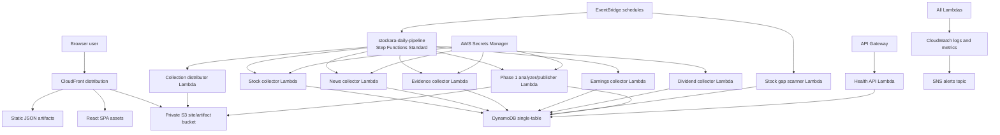
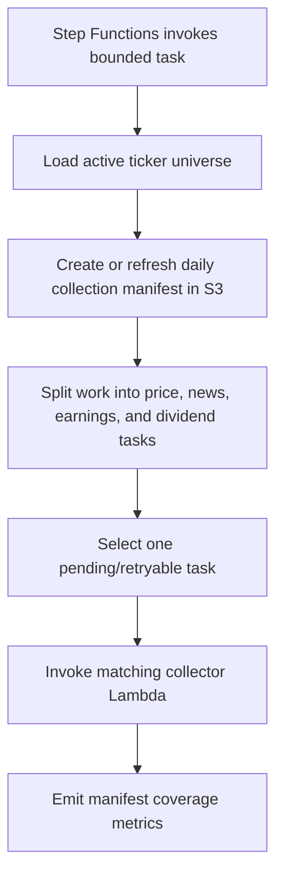
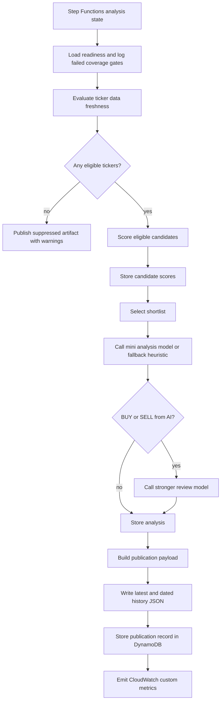

# Stockara AWS Architecture

Audience: architecture reviewers, AWS operators, and engineers.

Status: Stockara 1.0 production architecture. See `docs/steering/stockara-1.0.md` for the canonical baseline.

## Executive summary

Stockara 1.0 is a low-cost serverless AWS system. One Step Functions Standard Workflow coordinates bounded Lambda workers for metadata, market data, evidence, AI analysis/review, and publication. Source records live in DynamoDB, while static JSON artifacts are written to the same S3 bucket that hosts the React frontend. CloudFront serves both the web app and the published artifacts. API Gateway remains intentionally small and exposes health and authenticated application APIs.

## High-level AWS diagram

## Deployed stacks

The infrastructure is defined in AWS CDK Python.

- `DatabaseStack`: DynamoDB single-table store.
- `FrontendStack`: private S3 bucket, CloudFront distribution with Origin Access Control, SPA fallback routing, frontend deployment.
- `ApiStack`: Lambda functions, API Gateway health endpoint, EventBridge schedules, Secrets Manager references, IAM grants, watchlist seed custom resource.
- `MonitoringStack`: CloudWatch log groups, metrics alarms, and SNS alerts topic.

## Compute resources

Current Lambda functions:

| Function | Handler | Memory | Timeout | Purpose |
|---|---|---:|---:|---|
| Stock collector | `src.collectors.stock_collector.handler` | 512 MB | 15 min | Collects OHLCV, backfills gaps, imports Stooq backfill data |
| Stooq zip extractor | `src.scripts.stooq_zip_extractor.handler` | 1024 MB | 15 min | Extracts uploaded Stooq zip files to S3 for backfill |
| Stock gap scanner | `src.collectors.stock_gap_scanner.handler` | 256 MB | 5 min | Scans recent history for missing OHLCV rows and queues tasks |
| Watchlist seed | `backend.src.scripts.seed_watchlist_handler.handler` | 256 MB | 3 min | Seeds and syncs active watchlist metadata |
| News collector | `src.collectors.news_collector.handler` | 256 MB | 5 min | Collects and summarizes news |
| Evidence collector | `src.collectors.evidence_collector.handler` | 256 MB | 10 min | Collects SEC, analyst, sector, and macro signals |
| Earnings collector | `src.collectors.earnings_collector.handler` | 256 MB | 10 min | Collects earnings calendar and historical reactions |
| Dividend collector | `src.collectors.dividend_collector.handler` | 256 MB | 10 min | Collects dividend calendar and historical reactions |
| Collection distributor | `src.collectors.collection_distributor.handler` | 256 MB | 5 min | Creates the daily collection manifest and dispatches bounded tasks |
| Phase 1 analyzer/publisher | `src.analysis.ai_analyzer.handler` | 1024 MB | 15 min | Scores candidates, analyzes shortlist, publishes static artifacts |
| Health API | `src.api.handler.handler` | 256 MB | 15 sec | Serves `/api/health` |

## EventBridge schedules

Current schedules from CDK:

| Schedule | Target | Purpose |
|---|---|---|
| 21:05 UTC daily | Step Functions `stockara-daily-pipeline` | Owns the complete daily collection, repair, analysis, review, and publication flow |
| Three times daily | News collector | Quota-conscious global news prefetch |
| 23:15 UTC daily | Stock gap scanner | Price gap detection and backfill task creation |
| 22:30 UTC daily | Demo trade executor | Applies eligible reviewed recommendations to simulated accounts |

The old high-frequency distributor, stock collector, and analyzer schedules are
disabled rollback paths. Calendar and evidence collection are invoked by the
daily workflow rather than racing the analyzer on independent clocks.

## Lambda workflow: collection distributor

The distributor keeps collection work bounded. It prevents one large daily job from depending on a single long-running Lambda invocation.

## Lambda workflow: analyzer/publisher

## DynamoDB structure

DynamoDB is a single-table design with:

- Partition key: `PK` string.
- Sort key: `SK` string.
- GSI1: `GSI1PK`, `GSI1SK`, projection all.
- GSI2: `GSI2PK`, `GSI2SK`, projection all.
- Billing: pay per request.
- Encryption: AWS managed.
- Point-in-time recovery: enabled.
- Removal policy: retain.

Important entity patterns:

| Entity | Key shape | Main use |
|---|---|---|
| Stock metadata | `PK=STOCK#{ticker}`, `SK=META`, `GSI1PK=STOCK`, `GSI1SK={ticker}` | Active watchlist and static company metadata |
| Stock data | `PK=STOCKDATA#{ticker}`, date sort key | OHLCV history by ticker/date |
| Market signal | Ticker/date/type-specific keys | SEC, analyst, price target, sector, macro, price/volume evidence |
| Earnings event | Ticker/date keys | Upcoming and historical earnings context |
| Dividend event | Ticker/date keys | Upcoming and historical dividend context |
| News summary | Hash/title-source keys plus ticker lookup fields | Deduplicated article summaries |
| Config list | Config name key | Sell-alert watchlist and other lists |
| Candidate score | Date/ticker keys | Daily opportunity and negative scores |
| Candidate analysis | Date/ticker keys | Daily AI/fallback analysis result |
| Publication record | Date key | Published payload audit record |
| Collection summary | Component key | Last run health and metrics |

The current repository also preserves broader product requirements for future authenticated portfolio and demo-trading entities, but the Phase 1 deployed code focuses on public static artifacts and health.

## S3 structure

The frontend stack creates one private S3 bucket for static site files and generated artifacts. CloudFront reads it through Origin Access Control. Frontend deployments exclude generated artifact prefixes and do not prune them.

Important prefixes:

| Prefix | Producer | Consumer | Purpose |
|---|---|---|---|
| `/index.html`, `/assets/*` | Frontend build/deployment | Browser via CloudFront | React SPA |
| `top-picks/latest.json` | Analyzer/publisher | Dashboard | Latest full publication |
| `top-picks/history/YYYY-MM-DD.json` | Analyzer/publisher | Operators/audits | Dated publication archive |
| `sell-alerts/latest.json` | Analyzer/publisher | Dashboard/consumers | Latest sell-alert subset |
| `sell-alerts/history/YYYY-MM-DD.json` | Analyzer/publisher | Operators/audits | Dated sell-alert archive |
| `data-health/latest.json` | Collection health publishing code | Data Freshness view | Collection manifest status |
| `data-readiness/latest.json` | Phase 1 analyzer/publisher | Data Freshness view | Daily readiness issues and repair modes |
| `news/latest.json` | News collector | Data Freshness view | Recent news coverage summary |
| `price-gaps/latest.json` | Stock gap scanner | Data Freshness view | Missing OHLCV ranges |
| `stock-history/*` | Stock collector/backfill | Operators/collectors | Historical price artifacts and backfill support |
| `stooq/*`, `stooq-extracted/*` | Manual upload and extractor | Backfill collector | Stooq zip import workflow |

JSON artifacts are written with `ContentType=application/json` and short public cache-control, currently five minutes for top-picks and sell-alert outputs.

## API Gateway

API Gateway hosts a small public REST API:

- `GET /api/health`

The stage has throttling configured at 20 requests/sec with burst 40 and allows CORS for GET/OPTIONS. Public reads for top picks, alerts, data freshness, news coverage, and price gaps are served directly as static CloudFront/S3 JSON, not through API Gateway.

## Secrets and external providers

Secrets are referenced from Secrets Manager by deployment-stage-specific names:

- `stockara/{stage}/openai-api-key-current`
- `stockara/{stage}/newsapi-key-current`
- `stockara/{stage}/finnhub-key-current`
- `stockara/{stage}/alpha-vantage-api-key-current`

Secrets are granted only to Lambdas that need them:

- OpenAI: news collector and analyzer/publisher.
- NewsAPI: news collector.
- Finnhub: news collector and evidence collector.
- Alpha Vantage: news collector and stock collector.

## IAM model

The batch role is used by collectors, scanner, analyzer, publisher, and seeding jobs. It has:

- AWSLambdaBasicExecutionRole.
- `cloudwatch:PutMetricData`.
- Read/write grants to DynamoDB where required.
- Read/write or put grants to the artifact bucket where required.
- Lambda invoke permission for orchestration and collector chaining.
- Secrets read grants scoped to relevant functions.

The health API role has:

- AWSLambdaBasicExecutionRole.
- Read-only DynamoDB access.

## Observability

The monitoring stack creates:

- CloudWatch log groups with one month retention.
- Lambda error alarms for each key function.
- Custom metric alarms for artifact publish failures, partial/failed stock collection, low stock collection completeness, partial/failed news collection, low news completeness, stale/incomplete manifests, retry-exhausted tasks, low coverage gates, provider failures, and missing publication/collection metrics.
- SNS topic for alerts.

Metric namespaces:

- `StockMonitoring` for collection and manifest metrics.
- `StockaraPhase1` for publication and analysis metrics.

## Deployment workflow

The project policy for current Phase 1 development is to commit implementation work directly to `main`; branch-scoped AWS environments are intentionally disabled unless explicitly re-enabled. Pushes to `main` are expected to run tests, build the frontend, synth/deploy CDK, and smoke-test `/api/health`.

## Architecture review notes

Strengths:

- Static artifact read model keeps public reads cheap and resilient.
- DynamoDB pay-per-request and Lambda scheduling avoid always-on compute.
- Publication artifacts are auditable and reproducible by date.
- Data quality warnings are part of the public payload.
- CloudFront serves UI and data from one origin.

Risks and review topics:

- Batch sizing is conservative; full universe freshness depends on repeated scheduled invocations and manifest health.
- Provider rate limits and provider schema drift remain operational risks.
- Single-table access patterns should be reviewed before adding authenticated portfolio/demo features.
- API Gateway currently covers health only; future authenticated APIs need separate auth/IAM review.
- The stronger review model suppresses weak recommendations, but model availability is still a publication dependency for actionable AI output.
