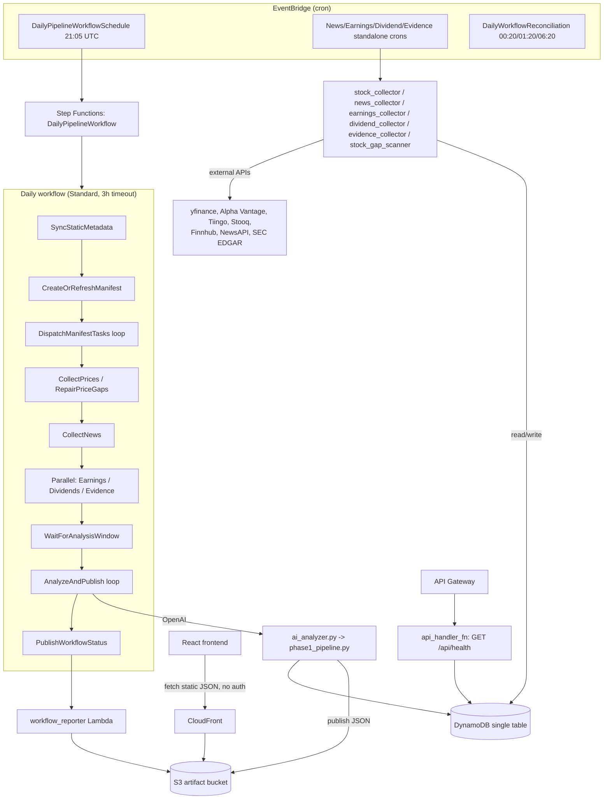

# Stockara — Architecture & Code Review

Reviewed repo: `github.com/csenkey/stockara` (HEAD `a5fe05e`, 178 commits, Aug 26 2026).
Scope: infrastructure code, backend Python, frontend TypeScript, CI workflows, and CDK-provisioned AWS resources. Documentation files (`*.md`, `.kiro/`, `docs/`) were intentionally excluded — every claim below is sourced from source or config files, with file:line references.

## 1. System overview

Stockara is a serverless AWS application that scores US equities daily and publishes a small set of static JSON "recommendation" artifacts (top picks, sell alerts, calendars, health status) that a static React frontend reads directly from S3/CloudFront. There is effectively **no traditional backend API** — the only live endpoint is `GET /api/health`. All product data reaches the browser as pre-computed JSON files, not as API responses.

Stack:

| Layer | Technology |
|---|---|
| Compute | AWS Lambda, Python 3.12, orchestrated by a single AWS Step Functions state machine |
| Data store | Single DynamoDB table (`PK`/`SK` + 2 GSIs), pay-per-request, PITR on |
| Artifacts | S3 bucket, published as JSON, served via CloudFront (SPA-style routing) |
| Frontend | React 18 + Vite + Tailwind, no router library, no live API client |
| IaC | AWS CDK (Python), 4 stacks: Database, Frontend, Api, Monitoring |
| External data | yfinance, Alpha Vantage, Tiingo, Stooq, Finnhub, NewsAPI, SEC EDGAR, OpenAI |
| CI/CD | One GitHub Actions workflow (`deploy.yml`): lint → test → `cdk synth` → `cdk deploy --all` → smoke test, on every push to `main` |

## 2. Component map



## 3. Component inventory

### 3.1 Infrastructure (CDK, `infrastructure/stacks/`)

- **DatabaseStack** — one DynamoDB table, `PK`/`SK` + `GSI1`/`GSI2` (`ALL` projection), `PAY_PER_REQUEST`, point-in-time recovery, `RemovalPolicy.RETAIN`. No relational store anywhere in the system.
- **FrontendStack** — S3 (versioned, `BLOCK_ALL`, encrypted, `RETAIN`) behind CloudFront with Origin Access Control, TLS 1.2_2021 minimum, SPA 403/404 → `index.html` rewrite, IPv6 explicitly disabled (comment cites client timeout issues), optional Route53/ACM custom domain. `BucketDeployment` excludes the artifact prefixes (`top-picks/*`, `sell-alerts/*`, `news/*`, `data-health/*`, `data-readiness/*`, `price-gaps/*`) with `prune=False` so redeploying the frontend never wipes backend-published data.
- **ApiStack** (`api_stack.py`, 1,424 lines) — the core compute stack. 12 Lambda functions (all Python 3.12): `stock_collector`, `stooq_zip_extractor`, `stock_gap_scanner`, `watchlist_seed` (CustomResource-backed), `news_collector`, `evidence_collector`, `earnings_collector`, `dividend_collector`, `collection_distributor`, `ai_analyzer` ("Phase1AnalyzerPublisherFunction"), `api_handler` ("HealthApiFunction"), `workflow_reporter` (the only one with `reserved_concurrent_executions=1` and a DLQ). One `RestApi` with a single route (`/api/health`, CORS open). One Step Functions state machine, `DailyPipelineWorkflow`. Four Secrets Manager secrets (OpenAI, NewsAPI, Finnhub, Alpha Vantage keys). Two IAM roles: a shared `batch_role` for all collectors/analyzer, and a minimal `api_role` for the health Lambda.
- **MonitoringStack** (947 lines) — SNS alert topic, per-Lambda error alarms (8 of the 12 functions), threshold/manifest-health/workflow/product-quality alarm tiers, 5 "missing metric" dead-man's-switch alarms, one dashboard. Critically, it does **not** receive CDK object references from `ApiStack` — it independently recomputes physical resource names via the shared `naming.resource_name()` helper (`monitoring_stack.py:34-71`) and builds ARNs by hand. There is no compile-time link between the two stacks.

### 3.2 Backend pipeline (`backend/src/`)

- **Collectors** (`collectors/`): one Lambda per data domain — price OHLCV (`stock_collector.py`, provider waterfall yfinance → Alpha Vantage → Nasdaq → Stooq, each with 3-attempt backoff), earnings/dividends (`earnings_collector.py`, `dividend_collector.py`, yfinance primary + Finnhub/Alpha Vantage fallback), news (`news_collector.py`, NewsAPI + Finnhub + Alpha Vantage, OpenAI summarization), evidence (`evidence_collector.py`, SEC EDGAR filings + Finnhub analyst data + sector/macro proxies via yfinance), and a pure-DB gap scanner (`stock_gap_scanner.py`, hand-rolled US market holiday calendar). `collection_distributor.py` builds the daily manifest and dispatches tasks to the other collectors asynchronously.
- **Analysis** (`analysis/`): `ai_analyzer.py` is a 9-line Lambda shim; all logic lives in `phase1_pipeline.py` (5,020 lines) — scoring, shortlisting, OpenAI-based analysis and review, fallback heuristics, and publication of `top-picks/*`, `sell-alerts/*` JSON to S3.
- **Services** (`services/`): `secrets.py` (Secrets-Manager-backed, `lru_cache`d key lookup), `collection_manifest.py` (538 lines — the task-leasing/retry/coverage state machine shared by every collector), `workflow_status.py` + `workflow_reporter.py` (new as of the latest commit — single-writer publisher for `workflow/latest.json`, triggered by EventBridge state-change events, a reconciliation cron, or the state machine directly), `provider_health.py`, `calendar_artifacts.py`, `static_artifacts.py`.
- **DB layer** (`db/connection.py`, 1,077 lines): a `DatabasePool` singleton wrapping one `boto3.resource("dynamodb").Table`. No actual connection pooling exists or is needed — the class is a naming holdover from what looks like an earlier relational design. Conditional writes (`ConditionExpression=Attr("PK").not_exists()`) give idempotent inserts; a `version`-attribute optimistic-concurrency pattern protects the manifest.
- **API** (`api/`): `handler.py` is FastAPI + Mangum wrapping a single router; `health.py` computes per-component freshness (`ok`/`stale`/`missing`/`degraded`) against hardcoded SLA-hour env vars and never raises — DB errors degrade the response rather than failing the request.
- **Backtesting** (`backtesting/`): explicitly a scaffold. `cli.py` only supports a `plan` command that prints paths — nothing executes a simulation. `portfolio_generator.py`'s own comment says initial purchases are "a later data-dependent task," and `recommendation_replay.py` hard-blocks live AI replay. No code path wires the simulator, portfolio generator, policies, and replay reader together.

### 3.3 Frontend (`frontend/src/`)

Hand-rolled hash router (`App.tsx`, three views: top-picks, calendar, data-health) with no 404 handling. All three pages fetch static JSON artifacts directly from CloudFront (`top-picks/latest.json`, `workflow/latest.json`, `data-health/latest.json`, `price-gaps/latest.json`, etc.) with `{cache: "no-store"}` — there is no dynamic API client and no polling; data only refreshes on page load or manual button click. `workflowFreshness.ts` computes staleness against the known 21:05 UTC schedule, but only `Dashboard.tsx` uses it; `Calendar.tsx` and `DataHealth.tsx` have no equivalent staleness signal.

## 4. Daily production flow, as implemented

1. **21:05 UTC** — `DailyPipelineWorkflowSchedule` starts `DailyPipelineWorkflow`.
2. Manifest build/dispatch loop runs, price collection and gap repair execute, then `CollectNews` → parallel `CollectEarnings`/`CollectDividends`/`CollectEvidence`.
3. After `WaitForAnalysisWindow`, `AnalyzeAndPublish` (the `ai_analyzer`/`phase1_pipeline` Lambda) scores candidates, calls OpenAI to analyze and review the shortlist, and publishes `top-picks/latest.json` and `sell-alerts/latest.json` to S3.
4. `PublishWorkflowStatus` and the state-change EventBridge rule both invoke `workflow_reporter`, which writes `workflow/latest.json`.
5. The React frontend, on load, fetches these JSON files from CloudFront and renders them; `/api/health` independently reports DynamoDB-derived freshness.
6. In parallel, standalone EventBridge crons (06:30/14:30/21:30 for news, 20:00/20:15/20:45 for earnings/dividends/evidence) run the same collector Lambdas outside the workflow, in a "repair" mode.

This is a reasonable design for a low-traffic, batch-oriented product — it avoids running servers and keeps the frontend maximally simple. The problems are in the reliability of steps 3 and 6, detailed next.

## 5. Gaps found — most likely causes of production failures

### 5.1 Critical: the AI analysis/review/news-summarization model IDs are almost certainly invalid

`infrastructure/stacks/api_stack.py:266,410-411` set:

```python
"OPENAI_NEWS_MODEL": "gpt-5.6-luna",
"OPENAI_ANALYSIS_MODEL": "gpt-5.6-luna",
"OPENAI_REVIEW_MODEL": "gpt-5.6-terra",
```

with matching defaults hardcoded again in `phase1_pipeline.py:33-37` and `news_collector.py:40`. These are not real OpenAI model identifiers — no `gpt-5.6-luna`/`gpt-5.6-terra` model exists in OpenAI's catalog, and the naming pattern (dotted minor version + codename) doesn't match any real OpenAI model family. `git log` shows this was a deliberate change on **2026-07-31** (`ad93395`, "Update Stockara OpenAI model defaults"), replacing previously-set `gpt-5.4-mini` / `gpt-5.4`, and it is still in the code as of the latest commit (`a5fe05e`, 2026-08-26) — this has been live for roughly four weeks.

Every call site (`phase1_pipeline.py:2381-2413` for analysis, `:2555-2600` for review, `news_collector.py:~539` for summaries) wraps the OpenAI call in a broad `except Exception` that logs a `logger.warning` and falls back to a heuristic (`_fallback_analysis`, capped confidence, `analysis_method="fallback_heuristic"`). A 404 "model not found" response from OpenAI is indistinguishable, in the logs, from a transient outage — both just increment `candidate_ai_analysis_failed`/`fallback_analyses` counters. **Net effect: every AI-driven recommendation and every AI-generated news summary has likely been running in degraded heuristic mode since July 31, with no hard error anywhere to surface it.** The CI smoke test in `.github/workflows/deploy.yml` only emits `::warning::` for a degraded status — it never fails the pipeline (no `exit 1` on a degraded/failed collection status), so this could ship repeatedly without blocking a deploy.

**Fix:** verify the intended model IDs against the current OpenAI model catalog, correct the three env vars in `api_stack.py`, and add an explicit CloudWatch alarm/metric on `analysis_method == "fallback_heuristic"` rate so a future bad model ID (or a genuine OpenAI outage) is visible within one run, not four weeks.

### 5.2 High: two of four "optional" collectors report success even when they fail internally

`evidence_collector.py:1112-1138` and `news_collector.py:1316-1368` both catch every exception inside the Lambda handler and return `{"statusCode": 500, "body": {...}}` — a normal, successful Lambda invocation from AWS's point of view. Compare `stock_collector.py:360-366`, `earnings_collector.py`, and `dividend_collector.py`, which all `raise` after recording the failure, so Step Functions actually sees an error.

In `api_stack.py`, the workflow wires `add_catch(..., errors=["States.ALL"])` on the `CollectNews`/`CollectEvidence` steps (`~line 887, 918`) to route into `RecordNewsDegraded`/`RecordEvidenceDegraded` — but `States.ALL` only catches genuine Lambda/Step-Functions errors, never a "successful" invocation whose body happens to say `statusCode: 500`. The only payload the state machine actually inspects for a status code is `$.analysis.Payload.statusCode` (`api_stack.py:1276`). So when news or evidence collection fails outright (OpenAI down, all providers down, a DB write error), the workflow marks that step as fully successful, the intended degraded-path handling never fires, and the failure is only visible if something downstream separately notices the missing data.

**Fix:** make `evidence_collector.handler` and `news_collector.handler` re-raise on unhandled failure, matching the other three collectors, and let `add_catch` do its job. If a soft-fail return is genuinely wanted, add an explicit `Choice` state on `$.news.Payload.statusCode` / `$.evidence.Payload.statusCode` the same way `$.analysis.Payload.statusCode` is checked today.

### 5.3 High: a misconfigured worker retries forever instead of failing loudly

`collection_distributor.py:320-325`: when a task's function name isn't configured, the code marks the in-memory task `FAILED` but never calls `replace_collection_manifest_task`/`complete_persisted_manifest_task` to persist that to DynamoDB. On the next run, `refresh_manifest_task_state` (`collection_manifest.py:66-80`) re-reads the still-`pending` DynamoDB row and overwrites the S3 snapshot back to `pending` — so a one-time config error (a missing `*_COLLECTOR_FUNCTION_NAME` env var) becomes a silent, indefinite retry loop that never counts against `retry_exhausted_tasks` and never surfaces as a distinct alarm.

**Fix:** persist the `FAILED`/`worker_not_configured` status to DynamoDB via the same mutation path used elsewhere in this file, and add it to the retry-exhaustion accounting.

### 5.4 Medium: brand-new `workflow_reporter.py` has an unguarded dict access

This module was introduced in the most recent commit (`a5fe05e`, 2026-08-26 — deployed the day before this review). `workflow_reporter.py:271` logs `execution_status=payload["execution_status"]` unconditionally. For `mode == "publish_report"` (`:218-219`), `payload = event["report"]` comes straight from the caller and is not guaranteed to contain that key — only the `reconcile`/`execution_report`/`publish_workflow_status` code paths synthesize it. A `publish_report` call missing that field raises `KeyError` after the S3 artifact write has already succeeded, inside a Lambda that also carries `reserved_concurrent_executions=1` — an unhandled error here can leave the single-writer status-reporting path stuck.

**Fix:** use `payload.get("execution_status", "unknown")` (and audit the same function for other direct-index reads on caller-supplied payloads), and add unit test coverage for the `publish_report` mode with a minimal report dict, since the existing `test_workflow_reporter.py` (also introduced in this commit) should be checked for whether it already covers this path.

### 5.5 Medium: monitoring can silently drift out of sync with the resources it watches

`MonitoringStack` never receives CDK references to the Lambdas or state machine from `ApiStack` (see 3.1) — it recomputes the same physical names independently. If `ApiStack` ever changes how a function's name is derived without a matching change in `monitoring_stack.py`, the corresponding alarm just stops receiving data. Because `TreatMissingData.NOT_BREACHING` is the default, that alarm goes quiet rather than firing — the opposite of a fail-safe. There is also no direct Lambda-level `Errors` alarm for `evidence_collector`, `stooq_zip_extractor`, `stock_gap_scanner`, or `watchlist_seed` (only 8 of 12 functions are covered).

**Fix:** pass the actual CDK function/state-machine objects from `ApiStack` into `MonitoringStack` (via constructor args, as already done for `DatabaseStack`/`FrontendStack` → `ApiStack`) instead of re-deriving names, and add the four missing per-Lambda error alarms.

### 5.6 Low/noise: at least one alarm is likely to page on every run

`StockPriceGapsDetectedAlarm` (threshold ≥1 over a 26h period) fires on any single missing trading day anywhere in the watchlist, and `stock_gap_scanner.py` scans a 90-day lookback across the whole universe daily — a newly listed ticker or one bad symbol mapping is enough to trigger it continuously, training operators to ignore it.

### 5.7 Other correctness issues worth fixing opportunistically

- `_chat_completion_options` (`phase1_pipeline.py:2803-2807`) drops the `temperature` parameter entirely for any model starting with `gpt-5`, so the pipeline's `temperature=0.25`/`0.1` call-site arguments are silently ignored for the currently configured models — undermining any determinism assumption, and contradicting the checked-in strategy YAML's documented `temperature: 0`.
- News sentiment keyword matching (`phase1_pipeline.py:~3073`) uses unbounded substring matches — `"sec"` matches inside "se**c**urity", `"beat"` matches "heart**beat**" — which can flag benign news as a negative catalyst and feed a wrong signal into scoring.
- `put_stock_data_backfill_batch`'s exception handler (`db/connection.py:299-306`) is the one bare `except Exception:` in the codebase with **no logging at all** — a bulk-backfill failure is currently undiagnosable from logs.
- The frontend's three pages discard the actual fetch error and show one generic string regardless of cause (`Dashboard.tsx:796-804`, `DataHealth.tsx:307-308`, `Calendar.tsx:59-60`) — a 404 from a wrong `VITE_*_URL`, a CORS failure, and "not published yet" are all indistinguishable in the browser.
- `Calendar.tsx` has none of `Dashboard.tsx`'s "fall back to yesterday's publication while today's run is still pending" logic, so it silently shows an empty calendar during the same window where Dashboard correctly shows stale-but-valid data.

## 6. Recommendations for reliability and maintainability

**Fix now (production correctness):**
1. Correct the three OpenAI model env vars in `api_stack.py` and add a fallback-rate alarm (5.1) — this is very likely the single biggest thing quietly degrading output quality today.
2. Make `evidence_collector` and `news_collector` re-raise on failure like the other three collectors, so the existing `add_catch` wiring actually works (5.2).
3. Persist the `worker_not_configured` failure state to DynamoDB so it stops retrying forever (5.3).
4. Guard the `payload["execution_status"]` access in the just-shipped `workflow_reporter.py` (5.4).

**Fix soon (observability):**
5. Wire `MonitoringStack` to real CDK references instead of re-derived names, and add the four missing Lambda error alarms (5.5).
6. Make the CI smoke test in `deploy.yml` actually fail the deploy on a degraded/failed post-deploy health check, rather than only printing a warning — right now a broken integration can ship silently on every push to `main`.
7. Give `StockPriceGapsDetectedAlarm` (and similarly noisy alarms) a threshold based on percentage of watchlist affected, not an absolute count of 1.

**Simplify for maintainability:**
8. Rename `DatabasePool`/`get_db_connection` in `db/connection.py` — there is no connection pool; it's a single boto3 `Table` resource. The current naming actively misleads anyone expecting relational-style pooling/retry semantics.
9. Standardize the collector handler contract: pick one pattern (raise-on-failure, which Step Functions already understands) and apply it to all five collectors instead of two different conventions today.
10. Either delete the disabled "rollback path" EventBridge rules in `api_stack.py` (`StockCollectionSchedule`, `CollectionDistributorSchedule`, `Phase1PublishSchedule`) or add a code comment explaining the rollback plan — as-is they're dead weight that could confuse the next person editing a collector's schedule.
11. Decide whether the standalone news/earnings/dividend/evidence crons and the same steps inside the daily workflow are both meant to run daily, and document (in code, e.g. a comment on each `events.Rule`) why — right now nothing distinguishes "this is a redundant safety net" from "this is legacy and should be removed," and the two can run concurrently against the same rate-limited providers.
12. Either build the backtesting module's missing orchestrator (wiring `simulator`, `portfolio_generator`, `portfolio_policies`, and `recommendation_replay` together) or move it out of the main package into a clearly-marked `experimental/` location — right now it reads as complete but does nothing end-to-end.
13. Replace the ad hoc keyword-substring sentiment matcher with word-boundary matching (or a small allowlist regex) to remove the false-positive class in 5.7.

## 7. What's already solid

Worth noting so fixes don't crowd out what's working: the provider-fallback waterfalls (price, earnings, dividends) all have real exponential backoff and timeouts; DynamoDB writes use conditional puts and optimistic concurrency correctly; secrets are cached per warm container instead of re-fetched; the manifest/task-leasing system in `collection_manifest.py` is a genuinely solid piece of concurrency-safe design; and outside of the one instance noted in 5.7, there are no bare/silent `except` blocks anywhere in the backend — every other failure path at least logs.
